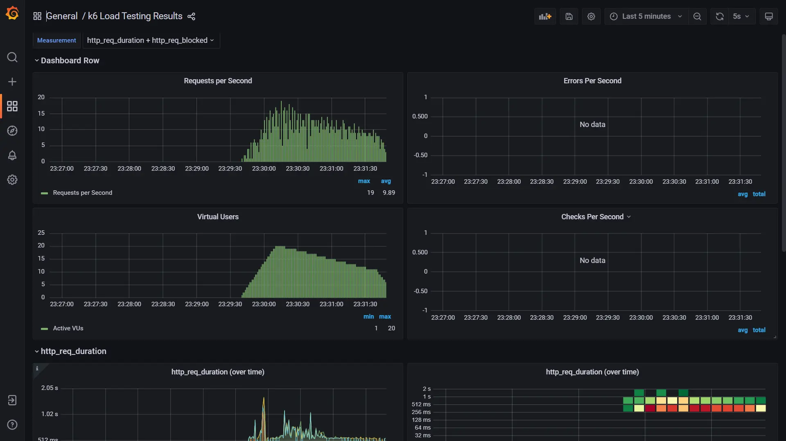

# Perfomance Testing with K6 and InfluxDB / Grafana
> Sample project to demonstrate how to use K6 and InfluxDB / Grafana to perform load testing

For more information, please refer to the [blog post](https://tiennhm.github.io/docs/k6/load-testing-restful-apis-with-k6-part-05).

Please note that this project is for demonstration purpose only. It is not intended to be used in production.

## Prerequisites
- [Docker](https://www.docker.com/)
- [Docker Compose](https://docs.docker.com/compose/)
- [K6](https://k6.io/)

Give me a star if you find this project useful. 🧑‍💻😊 Thank you!

